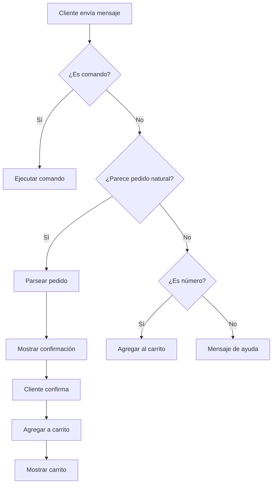

# 🎯 Guía de Pedidos con Lenguaje Natural

## 📋 Descripción

El bot ahora soporta **pedidos en lenguaje natural**, permitiendo a los clientes ordenar múltiples items en un solo mensaje, reduciendo costos de mensajería y mejorando la experiencia del usuario.

---

## ✨ Ventajas del Sistema

### 🔄 **ANTES** (Método anterior - ❌ Costoso)
```
Cliente: menu
Bot: [muestra menú]
Cliente: 1
Bot: Agregado al carrito
Cliente: 3
Bot: Agregado al carrito
Cliente: 7
Bot: Agregado al carrito
Cliente: 7
Bot: Agregado al carrito
Cliente: confirmar
Bot: Pedido confirmado
```
**Total: 10 mensajes** (5 del cliente + 5 del bot)

### ✅ **AHORA** (Método nuevo - ✨ Eficiente)
```
Cliente: Quiero 1 hamburguesa completa con 2 coca colas
Bot: [muestra resumen para confirmar]
Cliente: confirmar
Bot: Pedido confirmado
```
**Total: 4 mensajes** (2 del cliente + 2 del bot)

**Ahorro: 60% en costos de mensajería** 💰

---

## 🎤 Ejemplos de Pedidos

### ✅ Formato 1: Cantidades con "y"
```
Quiero 2 hamburguesas y 3 coca colas
```

### ✅ Formato 2: Con "con"
```
1 pizza muzzarella con 2 cervezas
```

### ✅ Formato 3: Imperativo
```
Dame una milanesa napolitana y papas fritas
```

### ✅ Formato 4: Con comas
```
2 empanadas de carne, 1 flan casero, 1 agua
```

### ✅ Formato 5: Números en texto
```
Quiero dos hamburguesas y tres coca colas
```

### ✅ Formato 6: Mezcla de formato
```
1 hamburguesa completa con papas fritas y 2 cervezas
```

### ✅ Formato 7: Abreviaturas y sinónimos
```
2 burgers con coca
```

### ✅ Formato 8: Cantidad implícita con "una", "un"
```
una hamburguesa
un flan con una cerveza
```

### ✅ Formato 9: Frases naturales para agua
```
botella de agua
2 botellas de agua y una hamburguesa
una aguita
```

---

## 🔍 Cómo Funciona

### 1. **Parser Inteligente** (`pedido-parser.js`)
- Reconoce nombres de productos y sus variaciones
- Extrae cantidades (números o palabras)
- Maneja sinónimos comunes
- Ignora palabras de conexión ("quiero", "con", "y", etc.)

### 2. **Flujo del Bot** (`bot-logic.js`)



### 3. **Doble Confirmación**
1. **Primera confirmación:** Verifica que el bot entendió correctamente
2. **Segunda confirmación:** Confirma el pedido final y lo envía a cocina

---

## 🧪 Casos de Prueba

### Prueba 1: Pedido Simple
```
Mensaje: "Quiero 1 hamburguesa"
Esperado: Reconoce "Hamburguesa Completa" y muestra confirmación
```

### Prueba 2: Pedido Múltiple
```
Mensaje: "2 pizzas con 3 cervezas"
Esperado: Reconoce 2x Pizza Muzzarella y 3x Cerveza
```

### Prueba 3: Con Sinónimos
```
Mensaje: "Dame 2 burgers y 1 coca"
Esperado: Reconoce Hamburguesa Completa y Coca Cola
```

### Prueba 4: Números en Texto
```
Mensaje: "Quiero dos empanadas y tres coca colas"
Esperado: Reconoce 2x Empanadas de Carne y 3x Coca Cola
```

### Prueba 5: Cantidad Implícita con "una"
```
Mensaje: "una hamburguesa"
Esperado: Reconoce 1x Hamburguesa Completa
```

### Prueba 6: Botella de Agua
```
Mensaje: "botella de agua"
Esperado: Reconoce 1x Agua Mineral
```

### Prueba 7: Items No Encontrados
```
Mensaje: "Quiero 1 pizza y 2 lomitos"
Esperado: Reconoce pizza, reporta que no encontró "lomito"
```

### Prueba 8: Método Anterior (Números)
```
Mensaje: "3"
Esperado: Agrega item #3 directamente (Hamburguesa Completa)
```

---

## 📊 Sinónimos Soportados

### Hamburguesa
- burger
- hambur
- burguesa

### Pizza
- piza
- pitsa

### Coca Cola
- coca
- cocacola
- coke

### Empanadas
- empanada
- empanadita

### Papas Fritas
- papas
- fritas
- patatas

### Milanesa
- mila
- milaneza

### Cerveza
- birra
- chela

### Agua Mineral
- agua
- aguita
- botella de agua
- botellita de agua
- botella agua

### Flan
- flanito

### Cantidades en Palabras
- un, una, uno → 1
- dos → 2
- tres → 3
- cuatro → 4
- cinco → 5
- seis → 6
- siete → 7
- ocho → 8
- nueve → 9
- diez → 10
- media, medio → 0.5

---

## 🎯 Comandos del Bot

### Comandos Principales
| Comando | Descripción |
|---------|-------------|
| `hola` / `menu` / `start` | Muestra el menú completo |
| `[pedido natural]` | Parsea y muestra confirmación |
| `[número]` | Agrega item por número directamente |
| `confirmar` / `si` / `ok` | Confirma pedido o items parseados |
| `ver` / `carrito` | Muestra el carrito actual |
| `cancelar` / `no` | Cancela el pedido |
| `eliminar` / `quitar` | Quita el último item |
| `ayuda` / `help` | Muestra ayuda completa |

---

## 🔧 Archivos Modificados

### 1. **bot-logic.js**
- ✅ Integrado parser de lenguaje natural
- ✅ Agregado sistema de confirmación en dos pasos
- ✅ Mejorados mensajes de ayuda y menú
- ✅ Mantiene compatibilidad con método anterior (números)

### 2. **menu.js**
- ✅ Exporta el array de menú para el parser
- ✅ Mantiene todas las funciones originales

### 3. **pedido-parser.js** (Nuevo)
- ✅ Parser inteligente de lenguaje natural
- ✅ Sistema de sinónimos y variaciones
- ✅ Extracción de cantidades (números y palabras)
- ✅ Genera mensajes de confirmación

---

## 🚀 Cómo Probar

### Paso 1: Iniciar el Backend
```bash
cd kds-webapp
npm run dev
```

### Paso 2: Exponer con ngrok
```bash
npm run ngrok
```

### Paso 3: Probar en WhatsApp Sandbox

Envía mensajes de prueba al número de Twilio:

1. **Prueba simple:**
   ```
   Quiero 1 hamburguesa
   ```

2. **Prueba múltiple:**
   ```
   2 pizzas con 3 cervezas
   ```

3. **Prueba con sinónimos:**
   ```
   Dame 2 burgers y 1 coca
   ```

4. **Prueba método anterior:**
   ```
   menu
   3
   7
   ver
   confirmar
   ```

### Paso 4: Verificar en KDS

- Abre `http://localhost:3000`
- Verifica que los pedidos aparezcan correctamente
- Confirma que las cantidades sean correctas

---

## 💡 Tips para Usuarios

### ✅ Buenas Prácticas
- Usa lenguaje natural: "Quiero 2 hamburguesas"
- Separa items con "y" o "con": "1 pizza con 2 cervezas"
- Puedes usar sinónimos: "burger", "coca", "mila"
- Los números pueden ser dígitos o palabras: "2" o "dos"

### ❌ Evita
- Ser demasiado ambiguo: "Dame comida"
- Items no en el menú: "Sushi" (si no está disponible)
- Mensajes sin contenido: "kjsdfkjds"

---

## 📈 Métricas de Ahorro

### Ejemplo de Restaurante Típico

**Escenario:** 100 pedidos por día

**Antes:**
- 100 pedidos × 10 mensajes promedio = **1,000 mensajes/día**
- 1,000 mensajes × $0.005 = **$5/día = $150/mes**

**Ahora:**
- 100 pedidos × 4 mensajes promedio = **400 mensajes/día**
- 400 mensajes × $0.005 = **$2/día = $60/mes**

**Ahorro: $90/mes (60%)** 💰

---

## 🐛 Troubleshooting

### Problema: Bot no reconoce el producto
**Solución:** Verifica que el nombre esté en el menú o agrega sinónimos en `pedido-parser.js`

### Problema: Cantidad incorrecta
**Solución:** Usa formato claro: "2 pizzas" en lugar de "pizzas 2"

### Problema: No se confirma el pedido
**Solución:** Después del resumen, escribe "confirmar" explícitamente

---

## 🔜 Próximas Mejoras

- [ ] Soporte para modificadores ("sin cebolla", "extra queso")
- [ ] Integración con NLP más avanzado (OpenAI, Dialogflow)
- [ ] Sugerencias inteligentes basadas en pedidos anteriores
- [ ] Validación de disponibilidad en tiempo real
- [ ] Soporte multiidioma (inglés, portugués)

---

## 📞 Soporte

Si encuentras problemas o tienes sugerencias:
1. Revisa los logs del backend
2. Verifica los mensajes en la consola
3. Consulta esta guía
4. Prueba el método anterior (números) como respaldo

---

**Última actualización:** 2024
**Versión:** 2.0 - Parser de Lenguaje Natural
