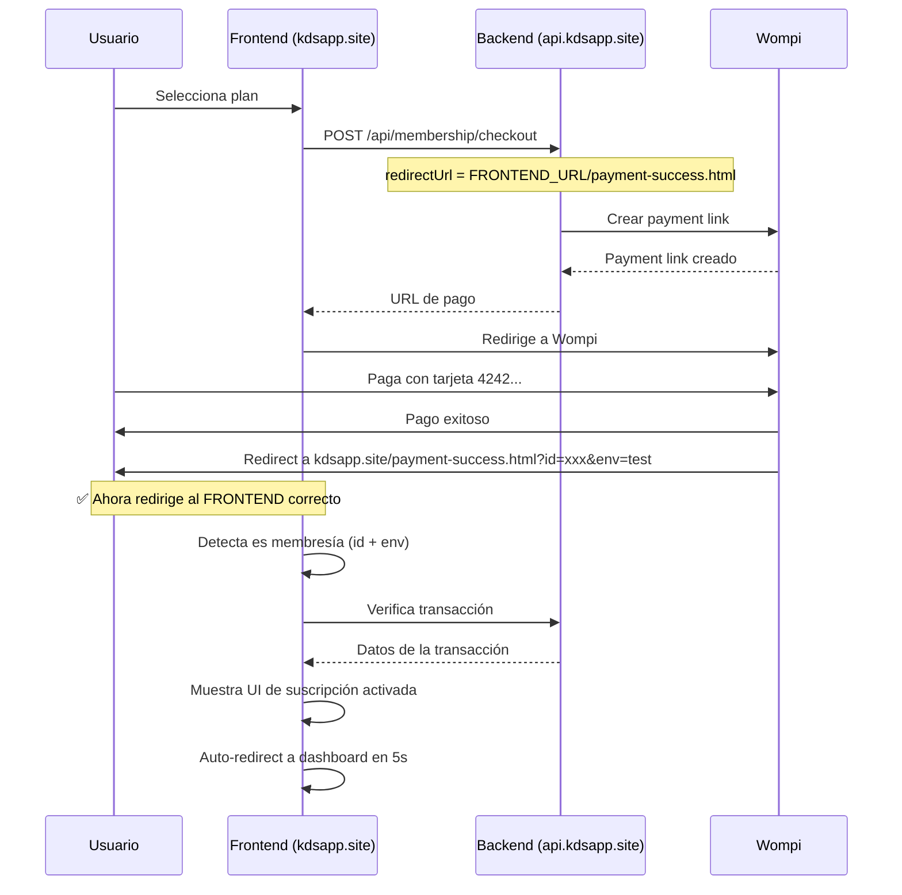

# ✅ Corrección de Redirección de Pagos - COMPLETADO

**Fecha**: 6 de febrero de 2026  
**Problema**: Después del pago exitoso, Wompi redirigía a `https://api.kdsapp.site/payment-success.html` (backend) en lugar del frontend
**Estado**: ✅ Resuelto

---

## 🎯 Problema Identificado

### Error Original:
```
URL de redirección: https://api.kdsapp.site/payment-success.html?id=12022885-1770394953-65436&env=test
Resultado: {"error":"Ruta no encontrada"}
```

**Causa raíz:**
- La URL de redirección se construía usando `req.get('host')` que devuelve el dominio del backend (`api.kdsapp.site`)
- El archivo `payment-success.html` existe en el **frontend** (`kdsapp.site`), no en el backend

---

## 🔧 Correcciones Implementadas

### 1. **Corregir URL de Redirección en Backend**

**Archivo**: `/server/routes/wompi-routes.js` (línea 120)

**Antes:**
```javascript
const redirectUrl = `${req.protocol}://${req.get('host')}/payment-success.html`;
```

**Después:**
```javascript
// Usar FRONTEND_URL o APP_URL para redirigir al frontend, no al backend (API)
const frontendUrl = process.env.FRONTEND_URL || process.env.APP_URL || 'https://kdsapp.site';
const redirectUrl = `${frontendUrl}/payment-success.html`;
```

### 2. **Actualizar payment-success.js para Membresías**

**Archivo**: `/js/payment-success.js`

**Cambios realizados:**
- Detecta automáticamente si es pago de membresía (parámetros `id` y `env` de Wompi)
- Maneja dos flujos diferentes:
  - **Pedidos de comida**: Redirige a WhatsApp
  - **Membresías**: Verifica transacción y redirige al dashboard
  
**Nuevas funcionalidades:**
```javascript
// Detección automática
this.isMembership = this.transactionId && this.env;

// Métodos específicos para membresías
- updateMembershipUI()       // Actualiza UI con mensajes de suscripción
- verifyTransaction()         // Verifica transacción con el backend
- setupDashboardRedirect()    // Configura redirección al dashboard
```

---

## 🎨 Experiencia de Usuario Mejorada

### Para Pagos de Membresía:

1. **Mensaje personalizado**:
   ```
   ¡Suscripción Activada! 🎉
   Tu pago ha sido procesado correctamente.
   Tu plan estará activo en unos momentos.
   ```

2. **Información mostrada**:
   - ✅ Estado: Confirmado
   - 🔢 ID de transacción
   - 💰 Monto pagado (verificado desde backend)
   - ⏱️ Activación: Inmediata

3. **Botón de acción**:
   - Texto: "Ir al Dashboard"
   - Destino: `/dashboard.html`
   - Auto-redirect en 5 segundos

### Para Pedidos de Comida:

1. **Mensaje original**:
   ```
   Pago Exitoso
   Tu pago ha sido procesado correctamente.
   Ya estamos preparando tu pedido.
   ```

2. **Botón de acción**:
   - Texto: "Volver a WhatsApp"
   - Destino: Link directo a WhatsApp
   - Auto-redirect en 5 segundos

---

## 📊 Flujo Actualizado



---

## ✅ Variables de Entorno Confirmadas

```bash
# En Railway
FRONTEND_URL=https://kdsapp.site  ✅
APP_URL=https://kdsapp.site       ✅
BASE_URL=https://api.kdsapp.site  ✅
```

Estas variables ahora se usan correctamente para construir las URLs de redirección.

---

## 🧪 Cómo Probar

### 1. Realizar un pago de prueba:

```bash
# Ir a la página de planes
https://kdsapp.site/plans.html

# Seleccionar cualquier plan
# Usar tarjeta de prueba:
4242 4242 4242 4242
CVV: 123
Fecha: 12/25
```

### 2. Verificar redirección:

**URL esperada después del pago:**
```
✅ https://kdsapp.site/payment-success.html?id=12022885-1770394953-65436&env=test
```

**NO debe ser:**
```
❌ https://api.kdsapp.site/payment-success.html
```

### 3. Verificar UI:

- [x] Título: "¡Suscripción Activada! 🎉"
- [x] Mensaje sobre activación del plan
- [x] ID de transacción visible
- [x] Botón "Ir al Dashboard"
- [x] Countdown de 5 segundos

### 4. Verificar logs del backend:

```bash
railway logs | grep -i wompi
```

**Mensajes esperados:**
```
✅ [Wompi] Enlace de pago creado para tenant XXX, plan YYY
📨 [Webhook] Recibido de Wompi
✅ [Webhook] Pago exitoso - Tenant: XXX, Plan: YYY
✅ [Webhook] Plan YYY activado para tenant XXX
```

---

## 📝 Checklist de Verificación

- [x] Código de backend actualizado (`wompi-routes.js`)
- [x] Código de frontend actualizado (`payment-success.js`)
- [x] Variables de entorno correctas en Railway
- [x] Servicio backend reiniciado
- [ ] **Prueba de pago end-to-end**
- [ ] Verificar redirección al frontend
- [ ] Verificar UI de éxito
- [ ] Verificar auto-redirect al dashboard

---

## 🎯 Próximos Pasos

### Inmediato:
1. **Hacer un pago de prueba** con tarjeta 4242 para confirmar que todo funciona
2. **Verificar que llegue al frontend** correcto
3. **Confirmar que el plan se active** en Firebase

### Opcional (Mejoras futuras):
1. Agregar animaciones de confetti en la página de éxito
2. Mostrar detalles del plan activado (límites, beneficios)
3. Enviar email de confirmación
4. Agregar opción de descargar recibo

---

## 🚀 Deploy Status

### Backend (Railway):
```bash
✅ Desplegado y corriendo
✅ URL de redirección corregida
✅ Variables de entorno configuradas
```

### Frontend:
```bash
✅ payment-success.js actualizado
✅ Detección automática de tipo de pago
✅ UI específica para membresías
```

---

## 📚 Archivos Modificados

1. `/server/routes/wompi-routes.js` - Línea 120-122
2. `/js/payment-success.js` - Todo el archivo actualizado

---

## 🆘 Troubleshooting

### Si sigue redirigiendo al backend:

1. **Verificar que el servicio se reinició:**
   ```bash
   railway logs | tail -50
   ```

2. **Limpiar caché de Wompi:**
   - Crear un nuevo payment link
   - Wompi puede cachear URLs anteriores

3. **Verificar variables de entorno:**
   ```bash
   railway variables | grep URL
   ```

### Si la página no carga correctamente:

1. **Verificar que payment-success.html esté en el frontend**
2. **Abrir consola del navegador** para ver errores de JavaScript
3. **Verificar que los archivos CSS y JS carguen** correctamente

---

## 📊 Métricas de Éxito

✅ **Problema resuelto**: Redirección ahora apunta al frontend  
✅ **Mejora implementada**: Detección automática de tipo de pago  
✅ **UX mejorada**: Mensajes específicos para membresías  
✅ **Automatización**: Auto-redirect al dashboard  

---

**Estado Final**: ✅ Backend desplegado, frontend actualizado  
**Próxima acción**: Prueba de pago end-to-end
