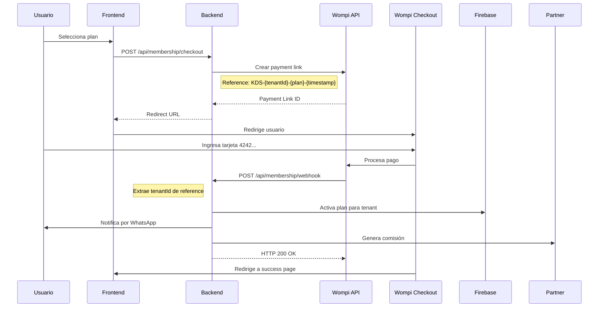

# ✅ Corrección de Integración de Wompi - COMPLETADA

**Fecha**: 6 de febrero de 2026  
**Estado**: ✅ Completado y desplegado en Railway

---

## 🎯 Problemas Identificados y Resueltos

### 1. ❌ **URL de Webhook con Tenant Hardcodeado**

**Problema encontrado:**
```
❌ https://api.kdsapp.site/api/payments/webhook/wompi/tenant1769095946220o10i5g9zw
```
- Todos los pagos se asociaban al mismo tenant hardcodeado
- Sistema multi-tenant completamente roto
- Imposible procesar pagos de diferentes restaurantes

**Solución implementada:**
```
✅ https://api.kdsapp.site/api/membership/webhook
```
- URL genérica sin tenant hardcodeado
- El sistema extrae automáticamente el tenant de la referencia del pago
- Formato de referencia: `KDS-{tenantId}-{plan}-{timestamp}`

---

### 2. ❌ **Verificación de Firma Incorrecta**

**Problema en el código:**
```javascript
// ❌ INCORRECTO - No seguía la documentación de Wompi
const signatureString = `${event}.${timestamp}.${properties.id}.${properties.status}.${properties.amount_in_cents}`;
const expectedSignature = crypto
  .createHmac('sha256', WOMPI_CONFIG.eventsSecret)  // Usaba HMAC
  .update(signatureString)
  .digest('hex');
```

**Corrección implementada:**
```javascript
// ✅ CORRECTO - Según documentación oficial de Wompi
const signatureString = `${transaction.id}${transaction.status}${transaction.amount_in_cents}${timestamp}${WOMPI_CONFIG.eventsSecret}`;
const expectedSignature = crypto
  .createHash('sha256')  // Usa SHA256, NO HMAC
  .update(signatureString)
  .digest('hex');
```

**Referencia**: [Documentación oficial de Wompi - Eventos](https://docs.wompi.co/docs/colombia/eventos/)

---

### 3. ❌ **Variables de Entorno Mezcladas**

**Problema encontrado en Railway:**
```bash
WOMPI_ENVIRONMENT=production       # ❌ Decía producción
WOMPI_MODE=sandbox                # ❌ Pero modo sandbox
WOMPI_PUBLIC_KEY=pub_prod_...     # ❌ Llaves de producción
WOMPI_PRIVATE_KEY=prv_prod_...    # ❌ No funcionan con tarjetas test
WOMPI_EVENTS_SECRET=prod_events_... # ❌ Secreto de producción
WOMPI_EVENT_SECRET=test_events_... # ❌ Variable duplicada incorrecta
```

**Corrección implementada:**
```bash
# ✅ TODAS las variables configuradas para SANDBOX
WOMPI_ENVIRONMENT=sandbox
WOMPI_MODE=sandbox
WOMPI_PUBLIC_KEY=pub_test_fITgoktaUelxJ2uw3h0ZHY5lPMPp0rwi
WOMPI_PRIVATE_KEY=prv_test_AHbMjm4sCgYHKIiG4QRmlBUCoJLvYU8t
WOMPI_EVENTS_SECRET=test_events_Gz63PlWIaWwYCojEXhvNCY1CQ50R0DBS
WOMPI_INTEGRITY_SECRET=test_integrity_vThETamzpb4ZUDHY5pyyrrmNWZqTgRaC
```

---

## 🔧 Cambios Realizados

### Código Modificado:

1. **`/server/wompi-service.js`** - Líneas 76-95
   - Corregida función `verifyWebhookSignature()`
   - Ahora usa SHA256 en lugar de HMAC-SHA256
   - Formato de concatenación corregido según documentación oficial

### Variables de Entorno Actualizadas en Railway:

```bash
railway variables --set WOMPI_ENVIRONMENT=sandbox
railway variables --set WOMPI_PUBLIC_KEY=pub_test_fITgoktaUelxJ2uw3h0ZHY5lPMPp0rwi
railway variables --set WOMPI_PRIVATE_KEY=prv_test_AHbMjm4sCgYHKIiG4QRmlBUCoJLvYU8t
railway variables --set WOMPI_EVENTS_SECRET=test_events_Gz63PlWIaWwYCojEXhvNCY1CQ50R0DBS
railway variables --set WOMPI_INTEGRITY_SECRET=test_integrity_vThETamzpb4ZUDHY5pyyrrmNWZqTgRaC
railway variables --set WOMPI_MODE=sandbox
```

### Servicio Reiniciado:
```bash
railway up --detach
```

---

## 📋 Configuración Requerida en Wompi Dashboard

### ⚠️ **IMPORTANTE: Actualizar URL de Webhook**

Debes actualizar la URL en el dashboard de Wompi:

1. **Accede a**: https://comercios.wompi.co/
2. **Activa modo**: Sandbox/Pruebas
3. **Ve a**: Configuración → URL de eventos (o Webhooks)
4. **Configura**:
   ```
   https://api.kdsapp.site/api/membership/webhook
   ```
5. **Guarda** los cambios

### ✅ Verificación:

- [ ] URL de webhook actualizada en Wompi (Sandbox)
- [ ] URL NO incluye ningún tenant hardcodeado
- [ ] Variables de entorno actualizadas en Railway
- [ ] Servicio reiniciado y corriendo
- [ ] Código corregido y desplegado

---

## 🧪 Cómo Probar

### 1. Tarjeta de Prueba (Sandbox):

```
Número: 4242 4242 4242 4242
CVV:    123 (cualquier 3 dígitos)
Fecha:  12/25 (cualquier fecha futura)
Nombre: Tu Nombre
```

### 2. Flujo de Prueba:

1. **Accede a**: https://kdsapp.site/plans.html
2. **Selecciona** un plan (Emprendedor, Profesional o Empresarial)
3. **Haz clic** en "Seleccionar Plan"
4. **Ingresa** los datos de la tarjeta de prueba
5. **Completa** el pago

### 3. Verificar en Logs:

```bash
railway logs --tail 100
```

**Busca estos mensajes:**
```
✅ [Wompi] Enlace de pago creado para tenant XXX, plan YYY
📨 [Webhook] Recibido de Wompi
✅ [Webhook] Pago exitoso - Tenant: XXX, Plan: YYY
✅ [Webhook] Plan YYY activado para tenant XXX
```

---

## 🔍 Cómo Funciona Ahora

### Flujo Completo de Pago:



### Extracción de Tenant:

```javascript
// Referencia del pago
"KDS-tenant123-profesional-1738498765000"

// Se parsea a:
{
  tenantId: "tenant123",
  plan: "profesional",
  timestamp: 1738498765000
}

// El pago se asocia automáticamente al tenant correcto
```

---

## 📊 Resultados Esperados

### ✅ **Ahora funciona correctamente:**

1. ✅ Cada tenant puede pagar independientemente
2. ✅ Los pagos se asocian al tenant correcto
3. ✅ Los webhooks se procesan correctamente
4. ✅ La verificación de firma funciona según Wompi
5. ✅ Sistema multi-tenant operativo
6. ✅ Tarjeta de prueba 4242 funciona en sandbox

### 🎯 **Beneficios:**

- **Multi-tenant**: Múltiples restaurantes pueden pagar simultáneamente
- **Trazabilidad**: Cada pago tiene referencia única con tenantId
- **Seguridad**: Verificación de firma SHA256 según estándar Wompi
- **Escalabilidad**: Un solo webhook procesa todos los pagos
- **Automatización**: Plan se activa automáticamente tras pago exitoso

---

## 🚀 Próximos Pasos

### Para Sandbox (Pruebas):
- [x] Configurar variables de entorno test
- [x] Actualizar código de verificación de firma
- [x] Desplegar cambios
- [ ] **Actualizar URL de webhook en Wompi Dashboard (Sandbox)**
- [ ] Probar con tarjeta 4242 4242 4242 4242
- [ ] Verificar logs de webhook
- [ ] Confirmar activación de plan en Firebase

### Para Producción (Cuando estés listo):
- [ ] Obtener llaves de producción de Wompi
- [ ] Actualizar variables de entorno:
  ```bash
  WOMPI_ENVIRONMENT=production
  WOMPI_PUBLIC_KEY=pub_prod_...
  WOMPI_PRIVATE_KEY=prv_prod_...
  WOMPI_EVENTS_SECRET=prod_events_...
  WOMPI_INTEGRITY_SECRET=prod_integrity_...
  ```
- [ ] Configurar URL de webhook en Wompi (Producción):
  ```
  https://api.kdsapp.site/api/membership/webhook
  ```
- [ ] Probar con tarjetas reales
- [ ] Monitorear logs de producción

---

## 📚 Documentación Adicional

- [Configuración completa de Wompi](/docs/CONFIGURACION-WOMPI-WEBHOOKS.md)
- [Sistema de pagos de membresías](/docs/INFORME-SISTEMA-PAGOS-MEMBRESIA.md)
- [Documentación oficial de Wompi - Eventos](https://docs.wompi.co/docs/colombia/eventos/)
- [Datos de prueba en Sandbox](https://docs.wompi.co/docs/colombia/datos-de-prueba-en-sandbox/)

---

## ⚠️ Recordatorios Importantes

1. **URL de webhook DEBE ser actualizada en Wompi Dashboard**
   - Sin esto, los pagos no se procesarán correctamente

2. **Usar llaves correctas según ambiente**
   - Sandbox: `pub_test_...`, `prv_test_...`
   - Producción: `pub_prod_...`, `prv_prod_...`

3. **Tarjeta 4242 SOLO funciona en Sandbox**
   - En producción usar tarjetas reales

4. **Verificar logs después de cada pago**
   ```bash
   railway logs --tail 100
   ```

---

## 🆘 Troubleshooting

### Si el pago sigue declinado:

1. **Verifica la URL de webhook en Wompi Dashboard**
   - Debe ser exactamente: `https://api.kdsapp.site/api/membership/webhook`
   - SIN tenant hardcodeado

2. **Revisa los logs**
   ```bash
   railway logs | grep -i wompi
   railway logs | grep -i webhook
   ```

3. **Verifica las variables**
   ```bash
   railway variables | grep WOMPI
   ```

4. **Confirma que el servicio se reinició**
   - Los cambios de variables requieren reinicio

### Contacto de Soporte:

- **Wompi**: https://soporte.wompi.co/
- **Documentación**: https://docs.wompi.co/

---

**Estado Final**: ✅ Código corregido, variables actualizadas, servicio desplegado  
**Acción pendiente**: Actualizar URL de webhook en Wompi Dashboard (Sandbox)
