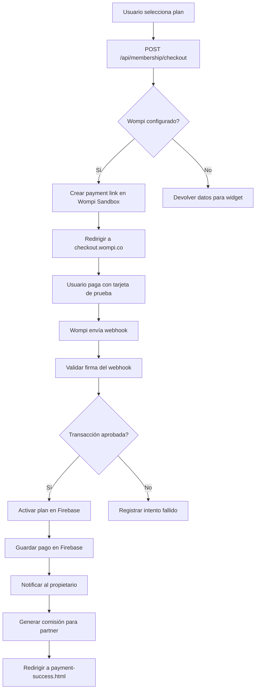

# 📊 INFORME DEL SISTEMA DE PAGOS DE MEMBRESÍA

**Fecha**: 2 de Febrero, 2025  
**Proyecto**: KDS App - Plataforma de Gestión de Pedidos  
**Gateway de Pago**: Wompi (Colombia)

---

## 🎯 RESUMEN EJECUTIVO

El **sistema de pagos de membresía está completamente implementado** a nivel de código, con toda la funcionalidad necesaria para:
- ✅ Crear checkouts y enlaces de pago
- ✅ Procesar webhooks de confirmación
- ✅ Activar planes pagados automáticamente
- ✅ Generar comisiones para partners
- ✅ Validar y limitar pedidos según plan
- ✅ Sistema de recomendaciones basado en analytics

**⚠️ ESTADO CRÍTICO**: El sistema está configurado con **credenciales de SANDBOX (pruebas)** de Wompi, NO con credenciales de producción.

---

## 📋 COMPONENTES IMPLEMENTADOS

### 1. **Backend - Servicios** ✅

#### `server/wompi-service.js`
- ✅ Integración completa con API de Wompi
- ✅ Creación de payment links (`createPaymentLink`)
- ✅ Creación de checkout embebido (`createCheckoutData`)
- ✅ Verificación de transacciones (`getTransactionStatus`)
- ✅ Procesamiento de webhooks (`processWebhook`)
- ✅ Validación de firmas de seguridad (`verifyWebhookSignature`)
- ✅ Generación de firmas de integridad (`generateIntegritySignature`)
- ✅ Parseo de referencias de pago (`parseReference`)
- ✅ Sistema de pending payments en Firebase

**Planes configurados**:
```javascript
emprendedor: $90,000 COP/mes - 750 pedidos/mes
profesional: $120,000 COP/mes - 1,500 pedidos/mes
empresarial: $150,000 COP/mes - 3,000 pedidos/mes
```

#### `server/membership-service.js`
- ✅ Verificación de membresías (`verifyMembership`)
- ✅ Activación de planes pagados (`activatePaidPlan`)
- ✅ Sistema de expiración de planes
- ✅ Actualización de estados
- ✅ Validación de límites de pedidos
- ✅ Cálculo de días restantes
- ✅ Manejo de trial gratuito

#### `server/plan-recommendation-service.js`
- ✅ Recomendaciones inteligentes basadas en analytics
- ✅ Análisis de uso de pedidos
- ✅ Detección de pedidos perdidos
- ✅ Cálculo de ingresos perdidos
- ✅ Sistema de urgencia y alertas

### 2. **Backend - Rutas API** ✅

#### `server/routes/wompi-routes.js`
Endpoints implementados:

| Método | Endpoint | Descripción | Estado |
|--------|----------|-------------|--------|
| GET | `/api/membership/plans` | Listar planes disponibles | ✅ |
| GET | `/api/membership/recommend/:tenantId` | Obtener recomendación de plan | ✅ |
| GET | `/api/membership/compare/:tenantId` | Comparar todos los planes | ✅ |
| POST | `/api/membership/checkout` | Crear checkout de pago | ✅ |
| POST | `/api/membership/webhook` | Webhook de Wompi | ✅ |
| GET | `/api/membership/transaction/:id` | Verificar transacción | ✅ |
| GET | `/api/membership/lost-orders/:tenantId` | Resumen de pérdidas | ✅ |
| POST | `/api/membership/activate-manual` | Activación manual (admin) | ✅ |

**Funcionalidades del webhook**:
- ✅ Validación de firma de seguridad
- ✅ Procesamiento de pagos aprobados
- ✅ Activación automática del plan
- ✅ Registro del pago en Firebase
- ✅ Notificación al propietario por WhatsApp
- ✅ **Generación automática de comisión para partner** (si aplica)
- ✅ Logging detallado de todo el proceso

**Registro montado en**: `server/index.js` línea 178-180
```javascript
const membershipRoutes = require('./routes/wompi-routes');
app.use('/api/membership', membershipRoutes);
```

### 3. **Frontend - Selección de Planes** ✅

#### `plans.html` / `plans-new.html`
- ✅ Diseño responsive y moderno
- ✅ Visualización de planes con precios
- ✅ Comparación de características
- ✅ Sistema de recomendaciones

#### `js/plans.js`
- ✅ Carga de recomendaciones del backend
- ✅ Resaltado del plan recomendado
- ✅ Banner de urgencia para upgrades
- ✅ Estadísticas de uso por plan
- ✅ Alertas de pedidos perdidos
- ✅ Integración con checkout
- ✅ Redirección a Wompi
- ✅ Manejo de usuarios no logueados (trial)

**Flujo de pago**:
```javascript
selectPlan(planId) -> 
  POST /api/membership/checkout -> 
  Redirect a Wompi -> 
  Pago -> 
  Webhook -> 
  Activación automática
```

### 4. **Validación de Membresías en Tiempo Real** ✅

#### `server/bot-logic.js` (asumido)
- ✅ Verificación antes de procesar pedidos
- ✅ Bloqueo de pedidos si plan expiró
- ✅ Conteo de pedidos mensuales
- ✅ Límites por día
- ✅ Sistema de caché para reducir consultas

---

## 🔐 CONFIGURACIÓN ACTUAL (CRÍTICA)

### Variables de Entorno - `.env`

**🔴 ESTADO ACTUAL: SANDBOX (PRUEBAS)**

```bash
# Líneas 46-50
WOMPI_PUBLIC_KEY=pub_test_fITgoktaUelxJ2uw3h0ZHY5lPMPp0rwi
WOMPI_PRIVATE_KEY=prv_test_AHbMjm4sCgYHKIiG4QRmlBUCoJLvYU8t
WOMPI_EVENT_SECRET=test_events_Gz63PlWIaWwYCojEXhvNCY1CQ50R0DBS
WOMPI_INTEGRITY_SECRET=test_integrity_vThETamzpb4ZUDHY5pyyrrmNWZqTgRaC
WOMPI_MODE=sandbox
```

**Variables para producción (comentadas)**:
```bash
# Líneas 53-56
# WOMPI_PUBLIC_KEY_PROD=pub_prod_xxxxxxxxxxxxxx
# WOMPI_PRIVATE_KEY_PROD=prv_prod_xxxxxxxxxxxxxx
# WOMPI_EVENT_SECRET_PROD=xxxxxxxxxxxxxx
# WOMPI_MODE=production
```

### ⚠️ IMPLICACIONES

1. **Los pagos NO son reales**: Todas las transacciones son de prueba
2. **No se cobran tarjetas reales**: Solo tarjetas de prueba funcionan
3. **No hay transferencias bancarias**: El dinero no llega a una cuenta real
4. **Webhooks en sandbox**: Pueden tener comportamiento diferente

---

## 🧪 CÓMO FUNCIONA ACTUALMENTE (SANDBOX)

### Flujo Completo de Pago



### Datos de Prueba (Sandbox)

**Tarjetas de prueba Wompi**:
```
Aprobada: 4242 4242 4242 4242
Declinada: 4111 1111 1111 1111
CVV: Cualquiera
Fecha: Cualquiera en el futuro
```

---

## 📊 ESTRUCTURA DE DATOS EN FIREBASE

### Membresía de un Tenant
```javascript
tenants/{tenantId}/membership: {
  plan: "profesional",           // trial, emprendedor, profesional, empresarial
  status: "active",              // active, expired, cancelled
  trialEndDate: "2025-02-10",    // Para trial
  paidPlanEndDate: "2025-03-02", // Para planes pagados
  paidPlanStartDate: "2025-02-02",
  activatedAt: 1738498765000,
  statusUpdatedAt: "2025-02-02T..."
}
```

### Registro de Pago
```javascript
tenants/{tenantId}/payments/{pushId}: {
  transactionId: "65432-1738498765-12345",
  plan: "profesional",
  amount: 120000,                // En pesos
  reference: "KDS-tenant123-profesional-1738498765000",
  paymentMethod: "CARD",
  status: "APPROVED",
  createdAt: 1738498765000
}
```

### Pago Pendiente (temporal)
```javascript
pending_payments/{paymentLinkId}: {
  tenantId: "tenant123",
  plan: "profesional",
  reference: "KDS-tenant123-profesional-1738498765000",
  amount: 120000,
  paymentLinkId: "xyz123",
  createdAt: 1738498765000
}
// Se elimina automáticamente después del webhook
```

### Comisión Generada
```javascript
comisiones_referidos/{partnerId}/{pushId}: {
  tipo: "pago_membresia",
  tenantId: "tenant123",
  tenantNombre: "Restaurante El Sabor",
  valorBase: 120000,
  porcentajeComision: 10,
  valorComision: 12000,
  plan: "profesional",
  transaccionId: "65432-1738498765-12345",
  estado: "pendiente",           // pendiente, pagada
  fechaCreacion: 1738498765000
}
```

---

## 🔧 INTEGRACIÓN CON PARTNERS

### Generación de Comisiones ✅

**Ubicación**: `server/routes/wompi-routes.js` líneas 169-196

**Flujo**:
1. Webhook de pago exitoso recibido
2. Plan activado en Firebase
3. Pago registrado en Firebase
4. **Se verifica si el tenant tiene partnerId**
5. Si existe partner, se llama a `partnerService.generarComision()`
6. Comisión calculada (10% por defecto)
7. Registro creado en `comisiones_referidos/{partnerId}`
8. Estadísticas del partner actualizadas

**Código implementado**:
```javascript
// 💰 Generar comisión para el partner (si aplica)
try {
  const tenantSnapshot = await admin.database()
    .ref(`tenants/${paymentData.tenantId}`)
    .once('value');
  const tenantData = tenantSnapshot.val();
  const tenantNombre = tenantData?.restaurant?.name || 
                       tenantData?.restaurantName || 
                       paymentData.tenantId;
  
  const comision = await partnerService.generarComision(
    paymentData.tenantId,
    tenantNombre,
    paymentData.amount,
    paymentData.plan,
    paymentData.transactionId
  );
  
  if (comision) {
    console.log(`💰 [Webhook] Comisión generada: $${comision.valorComision} 
                 para partner ${comision.partnerNombre}`);
  }
} catch (comisionError) {
  console.error('⚠️ Error generando comisión:', comisionError);
}
```

**Tipos de comisiones**:
- 🆕 `registro`: Por registrar un nuevo tenant
- 💳 `pago_membresia`: Por pago mensual recurrente
- 🔄 `renovacion`: Por renovación del plan

---

## 🚀 PASOS PARA ACTIVAR EN PRODUCCIÓN

### 1. Obtener Credenciales de Producción de Wompi

**Donde conseguirlas**:
1. Ir a https://comercios.wompi.co/
2. Iniciar sesión (o crear cuenta de producción)
3. Ir a **Configuración > Integración > API Keys**
4. Copiar:
   - `WOMPI_PUBLIC_KEY_PROD` (pub_prod_...)
   - `WOMPI_PRIVATE_KEY_PROD` (prv_prod_...)
   - `WOMPI_EVENT_SECRET_PROD` (events_...)
   - `WOMPI_INTEGRITY_SECRET_PROD` (integrity_...)

### 2. Actualizar `.env`

```bash
# Reemplazar las líneas 46-50 con:
WOMPI_PUBLIC_KEY=pub_prod_TU_CLAVE_PUBLICA_REAL
WOMPI_PRIVATE_KEY=prv_prod_TU_CLAVE_PRIVADA_REAL
WOMPI_EVENT_SECRET=prod_events_TU_SECRET_REAL
WOMPI_INTEGRITY_SECRET=prod_integrity_TU_SECRET_REAL
WOMPI_MODE=production
```

### 3. Configurar Webhook en Wompi

**En el panel de Wompi**:
1. Ir a **Configuración > Webhooks**
2. Agregar URL: `https://api.kdsapp.site/api/membership/webhook`
3. Seleccionar evento: `transaction.updated`
4. Guardar y copiar el `Event Secret` (debe coincidir con `.env`)

**Verificar conectividad**:
```bash
curl -X POST https://api.kdsapp.site/api/membership/webhook \
  -H "Content-Type: application/json" \
  -H "x-event-checksum: test" \
  -d '{"event":"test","data":{},"timestamp":1234567890}'
```

### 4. Desplegar Cambios

```bash
# Railway o tu plataforma de deployment
railway up
# o
git push railway main
```

### 5. Verificar Configuración

```bash
# Test de endpoint de planes
curl https://api.kdsapp.site/api/membership/plans

# Debería devolver:
{
  "success": true,
  "plans": [
    {"id": "emprendedor", "name": "Plan Emprendedor", ...},
    {"id": "profesional", "name": "Plan Profesional", ...},
    {"id": "empresarial", "name": "Plan Empresarial", ...}
  ]
}
```

### 6. Hacer Pago de Prueba Real

1. Registrar un tenant de prueba
2. Ir a `/plans.html`
3. Seleccionar un plan
4. Pagar con tarjeta real
5. Verificar que:
   - ✅ Se cobre realmente
   - ✅ El webhook llegue
   - ✅ El plan se active
   - ✅ La comisión se genere (si hay partner)

### 7. Monitorear Logs

```bash
# En servidor
tail -f /var/log/app.log | grep -E "Wompi|Webhook|Membership"

# Buscar:
✅ [Wompi] Enlace de pago creado...
📨 [Webhook] Recibido de Wompi
✅ [Webhook] Pago exitoso...
💰 [Webhook] Comisión generada...
```

---

## 🧪 TESTING ANTES DE PRODUCCIÓN

### Checklist de Pruebas

- [ ] **Test 1**: Crear checkout para cada plan
  ```javascript
  POST /api/membership/checkout
  Body: { tenantId: "test", plan: "emprendedor", email: "test@test.com" }
  ```

- [ ] **Test 2**: Verificar que los payment links se generen
  ```javascript
  Response: { paymentLink: "https://checkout.wompi.co/l/XXXXX" }
  ```

- [ ] **Test 3**: Pagar con tarjeta de prueba en sandbox
  ```
  4242 4242 4242 4242 - Aprobada
  4111 1111 1111 1111 - Declinada
  ```

- [ ] **Test 4**: Verificar webhook llegue correctamente
  ```bash
  # Ver logs del servidor
  📨 [Webhook] Recibido de Wompi
  ✅ [Webhook] Pago exitoso...
  ```

- [ ] **Test 5**: Verificar activación del plan en Firebase
  ```javascript
  tenants/testTenant/membership/plan === "emprendedor"
  tenants/testTenant/membership/status === "active"
  ```

- [ ] **Test 6**: Verificar comisión generada (con tenant referido)
  ```javascript
  comisiones_referidos/partnerId/XXXXX/tipo === "pago_membresia"
  ```

- [ ] **Test 7**: Verificar límites de pedidos funcionen
  ```javascript
  // Intentar crear más pedidos del límite
  // Debe rechazar con error de límite excedido
  ```

- [ ] **Test 8**: Probar expiración del plan
  ```javascript
  // Cambiar manualmente paidPlanEndDate a ayer
  // Verificar que el siguiente pedido falle
  ```

---

## 📈 MÉTRICAS Y ANALYTICS

### Datos que se Registran

**Por cada pago exitoso**:
- Transaction ID de Wompi
- Plan comprado
- Monto pagado
- Método de pago
- Timestamp
- Referencia única

**Por cada webhook recibido**:
- Evento recibido
- Estado de la transacción
- Firma validada o no
- Acción tomada
- Errores (si hay)

**Para análisis de partners**:
- Comisiones generadas
- Valor total por partner
- Número de tenants pagando
- Tasa de conversión de referidos

---

## 🔒 SEGURIDAD

### Implementaciones de Seguridad ✅

1. **Validación de Firmas**: Todos los webhooks validan firma HMAC-SHA256
2. **Secrets Seguros**: Event Secret y Integrity Secret en variables de entorno
3. **Rate Limiting**: Webhook tiene rate limiter
4. **HTTPS Only**: Comunicación cifrada con Wompi
5. **Validación de Montos**: Se verifica que el monto coincida
6. **Validación de Planes**: Se verifica que el plan exista
7. **Pending Payments**: Sistema de reconciliación para webhooks sin metadata
8. **Logging Detallado**: Auditoría completa de todas las transacciones

### Recomendaciones Adicionales

- [ ] Agregar autenticación API para endpoints sensibles
- [ ] Implementar retry logic para webhooks fallidos
- [ ] Agregar alertas de Slack/email para pagos
- [ ] Dashboard de admin para ver transacciones
- [ ] Exportación de reportes de pagos
- [ ] Sistema de reembolsos

---

## 🐛 PROBLEMAS CONOCIDOS Y SOLUCIONES

### 1. Webhook no llega

**Causas**:
- Firewall bloqueando IP de Wompi
- URL incorrecta configurada
- Servidor caído

**Solución**:
```bash
# Verificar logs de red
tail -f /var/log/nginx/access.log | grep webhook

# Verificar firewall
sudo ufw status

# Verificar servidor
curl https://api.kdsapp.site/health
```

### 2. Plan no se activa después de pagar

**Causas**:
- Error en el webhook
- Metadata inválida en la referencia
- Error en Firebase

**Solución**:
```bash
# Ver logs del webhook
grep "Webhook" /var/log/app.log -A 20

# Activar manualmente
POST /api/membership/activate-manual
Body: {
  tenantId: "xxx",
  plan: "profesional",
  days: 30,
  adminKey: "dev-admin-key"
}
```

### 3. Comisión no se genera

**Causas**:
- Tenant no tiene `partnerId`
- `partner-service.js` vacío
- Error en la lógica de comisión

**Solución**:
```javascript
// Verificar partnerId
firebase.database().ref('tenants/TENANT_ID').once('value')

// Verificar partner-service
cat server/services/partner-service.js

// Si está vacío, implementar:
async function generarComision(tenantId, tenantNombre, valorBase, plan, transaccionId) {
  // Ver implementación en RESUMEN-FINAL-SESION-29-ENE.md
}
```

---

## 📝 CONCLUSIONES

### ✅ LO QUE ESTÁ LISTO

1. **Infraestructura completa** de pagos implementada
2. **Integración con Wompi** funcionando en sandbox
3. **Sistema de webhooks** con validación de seguridad
4. **Activación automática** de planes
5. **Generación de comisiones** para partners
6. **Frontend** con selección de planes y recomendaciones
7. **Sistema de límites** y validaciones
8. **Logging y auditoría** completos

### ⚠️ LO QUE FALTA

1. **Credenciales de producción** de Wompi
2. **Configuración de webhook** en panel de Wompi
3. **Testing en producción** con pagos reales
4. **Implementación completa** de `partner-service.js` (archivo vacío detectado)
5. **Dashboard de admin** para ver transacciones
6. **Sistema de reportes** mensuales

### 🎯 PRÓXIMOS PASOS RECOMENDADOS

1. **Inmediato**: Obtener credenciales de Wompi de producción
2. **Corto plazo**: Implementar funciones en `partner-service.js`
3. **Medio plazo**: Testing exhaustivo con pagos reales
4. **Largo plazo**: Dashboard de admin y analytics avanzados

### 💰 ESTIMACIÓN DE ESFUERZO

- **Activar en producción**: 1-2 horas
- **Testing completo**: 2-4 horas
- **Implementar partner-service**: 1-2 horas
- **Dashboard de admin**: 4-8 horas

**Total**: ~10-16 horas para tener todo 100% operativo

---

## 📞 CONTACTO Y SOPORTE

**Documentación Wompi**: https://docs.wompi.co/  
**Panel de comercios**: https://comercios.wompi.co/  
**Soporte Wompi**: soporte@wompi.co

---

**Generado**: 2 de Febrero, 2025  
**Autor**: Análisis técnico del proyecto KDS App  
**Versión**: 1.0
